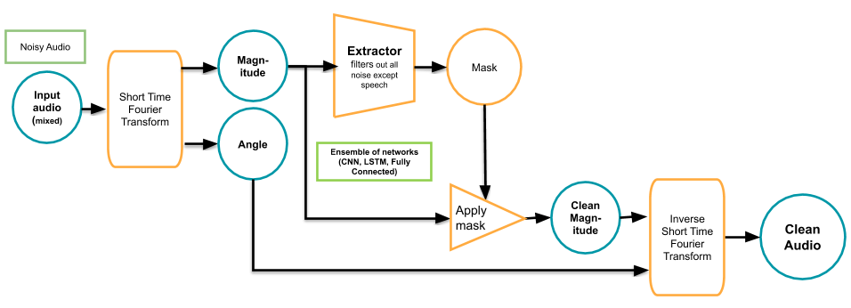
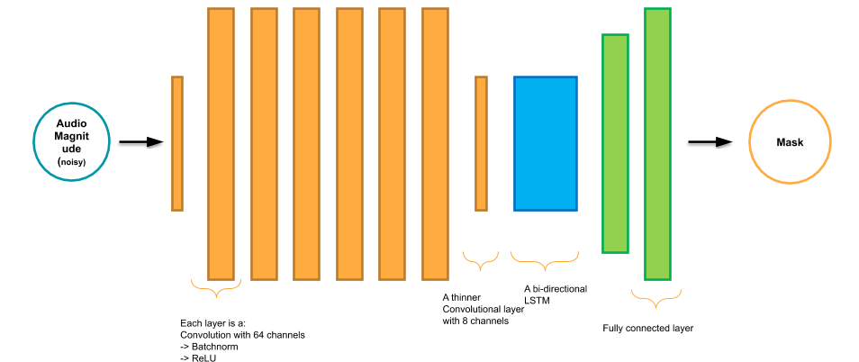

# Speaker Extraction
Using Deep Learning to extract just the Primary speaker from a noisy audio file containing random noise, music or even secondary speakers.  
## About
An implementation in PyTorch of [this](https://arxiv.org/abs/1810.04826) paper by good folks at
Google. I made some changes after weeks of trial and error, and am presenting
the results here.    
***Note***: Thanks to [this awesome github repo](https://github.com/mindslab-ai/voicefilter),
I was able to figure out how to work with audio.  

## Results
Sadly, github markdown doesn't allow showing audio directly. Checkout [http://anirudhs001.github.io/SpeechExtractor](http://anirudhs001.github.io/SpeechExtractor) to view the results or
download the files directly from `res/input` and `res/output`. 

## Setup
### Data preparation  
From a corpus of ~700 files, ~400 were manually selected and the noise was removed using audacity. Then, ~200
files from the original were selected and the noise extracted from them(noise includes human blabber, and weird
noises). These were then randomly padded to ensure the sounds don't unintentionally remain in 
the beginning or the ending. Finally these were randomly mixed to prepare a 10000 sample dataset.  
**Reason**: This is different from what the paper mentions, since their goal was a
bit different(which was to extract a single speaker from a mixture of two speakers, with the embeddings
given). 

    
     
    Figure 1. How the dataset is prepared

### Model Architecture
Since the motive was to reduce the noise irrespective of the speaker, I've ditched the Embedder mentioned
in the paper. Even without the target speaker's embeddings, the Model works fairly well.   
**Reason**: This maybe due to the randomisation in the data preparation step, or just dumb luck.  

    
     
    Figure 2. How the data is used for training  

The Extractor is the same model as mentioned in the paper: 6 CNNs, a bilinear LSTM, and 2 Fully connected
Layers. The output is a mask tensor which is applied on the original audio file to get the filtered
audio. I tried to add more convolutional layers and residual-connections in between those, but the
vanilla network seemed to perform better anyways(No Losses to back me up here :P).  
**Reason**: This can be due to the residual connections themselves: since we directly add the input of
the previous layer to output of the next layer, we are essentially passing the noisy audio as it is along
the network.

    
     
    Figure 3. Model Architecture

